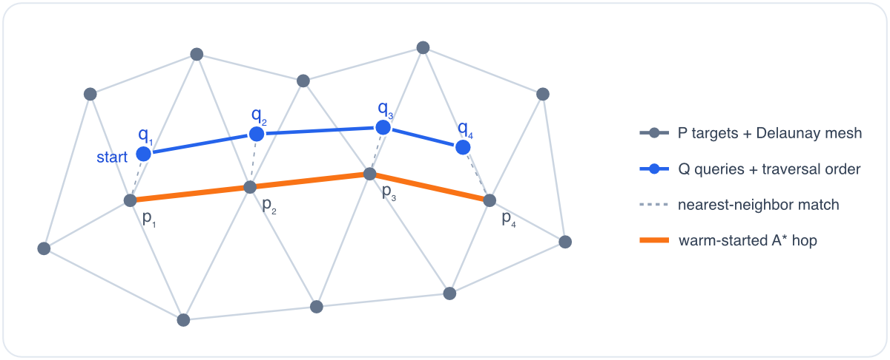

# `AANN`
**A**pproximate **A**ll **N**earest-**N**eighbor ("_aann_") search using neighborhood graphs. Implemented in Rust with Python bindings. Based on [Soudani & Karami (2018)](https://arxiv.org/abs/1802.09594).

It is optimised for **many nearest-neighbour joins that reuse the same clouds** —
build each cloud's index once, then query it again and again (e.g. an all-by-all
join). See [Usage](#usage).

### Problem

Given two point clouds `Q` and `P`, for each point `q` in `Q` find its nearest neighbor `p` among the points in `P`.

### Solution
1. Calculate neighborhood (e.g. Delaunay) graphs for both point clouds.
2. Start with a random vertex `q` in `Q` and traverse `P` using an A* search to find its nearest neighbor `p`.
3. Move to a vertex adjacent to `q` and search `P` for its nearest neighbor using `p` as the start. Since we start the search where we have already established spatial proximity the A* search should finish quickly.
4. Rinse-repeat until we found nearest neighbors for all points in `Q`.



### Limitations
We currently only support 3D point clouds and Euclidean distances but may extend this to N-dimensions and other metrics in the future.

## Install

We provide prebuilt wheels for Linux, macOS, and Windows on PyPI:

```bash
pip install aann
```

## Usage

`aann` is built for **repeated** nearest-neighbour queries against prepared
indices. Building an `AANN` index does the expensive work up front — triangulate
the cloud into a neighbourhood graph, SIMD-pack its coordinates, and (by default)
reorder them for cache locality — so that every subsequent `.query` is cheap. The
payoff grows the more you reuse an index; for a single one-off search the build
cost dominates and a plain KD-tree is simpler.

### Build an index once, query it many times

```python
import aann
import numpy as np

target = np.random.rand(10_000, 3)
index = aann.AANN(target)              # pay the build cost once...

for query in query_clouds:             # ...then amortise it over many queries
    distances, indices = index.query(query)

# k nearest neighbours per point -> (N, k) arrays, rows sorted by distance
# (k>1 is approximate; raise `ef` to trade search breadth for recall):
distances, indices = index.query(query, k=4)

# Ignore matches beyond a cutoff (scipy convention: misses get
# distance=inf and neighbour index=len(target)):
distances, indices = index.query(query, distance_upper_bound=0.05)
```

The query cloud can be a raw `(N, 3)` array, a `scipy`/`shull` `Delaunay`, or
another `AANN` — passing a prepared `AANN` skips re-triangulating it (the fast
path the all-by-all below uses). `k` counts *returned* neighbours (as in
`scipy.spatial.cKDTree.query`); the degree of the optional `graph="knn"`
neighbourhood graph is `graph_k`.

### All-by-all: every cloud against every other

This is where `aann` pulls ahead. Build one index per cloud with `prepare_many`
(parallel), then join them with `all_by_all`: every index is built and packed
**once** and reused across every pair it appears in, and the Rust search releases
the GIL so the pairs run concurrently across cores.

```python
indexes = aann.prepare_many(clouds)                 # list[AANN], built in parallel
results = aann.all_by_all(indexes)                  # every ordered i != j pair
results = aann.all_by_all(indexes, pairs=[(0, 1)])  # ...or a specific subset
# results[m] is the (distances, indices) for pairs[m] (query = i, target = j)
```

Because a cloud that appears in many pairs is triangulated and packed only once,
a full all-by-all over *n* clouds does *O(n)* index builds rather than *O(n²)* —
the reason `aann` suits workloads like NBLAST neuron-vs-neuron matrices.

### `aann` vs a KD-tree

Unlike a KD-tree, `aann` is a **cloud-vs-cloud** method: the query points are
themselves triangulated into a graph, so the warm-started descent starts each
query near the previous answer. That is what makes it fast on coherent clouds
(neurons, meshes, space-filling data) — but pass a whole cloud, not a handful of
scattered points, and expect *approximate* results for `k>1` (`k=1` is exact on a
Delaunay graph).

## Using from Rust

The core search is a plain Rust library — the Python bindings sit behind the
non-default `python` cargo feature. It requires a **nightly** toolchain
(`portable_simd`), so add a `rust-toolchain.toml` with `channel = "nightly"` to
your project, then:

```toml
[dependencies]
aann-graph = { git = "https://github.com/schlegelp/aann" }
```

The package is named `aann-graph` (plain `aann` is taken on crates.io by an
unrelated project) but its library target is `aann`, so in code you import it
as `aann`:

```rust
use aann::{graph_from_simplices, PreparedF64};
use aann::ndarray::array; // re-exported ndarray

// Target cloud + its Delaunay simplices (rows of 4 vertex ids):
let points = array![[0.0, 0.0, 0.0], [1.0, 0.0, 0.0], [0.0, 1.0, 0.0], [0.0, 0.0, 1.0]];
let (indptr, indices) = graph_from_simplices(array![[0u64, 1, 2, 3]].view(), 4);
let target = PreparedF64::new(points.view(), indptr.view(), indices.view());

// Query cloud with its own CSR neighbourhood graph:
let queries = array![[0.1, 0.0, 0.0], [0.9, 0.1, 0.0]];
let (qptr, qidx) = (array![0usize, 1, 2], array![1usize, 0]);
let (dists, idxs) = target.query(queries.view(), qptr.view(), qidx.view());
```

`PreparedF64::query_k(..., k, ef)` gives k nearest neighbours,
`query_prepared(&other)` is the pack-free prepared-vs-prepared fast path, and
everything exists in an `F32` flavour too (see the crate docs for the full
API, including the lower-level `Neighborhood*`/`search_*` functions).

## Benchmark

`bench.py` contrasts `aann` with `scipy.spatial.KDTree` on uniform random 3D
clouds, single-threaded (so it compares the algorithms, not the thread pools).
It makes the trade-off concrete — an `aann` index is expensive to build but cheap
to query, so it only pays off once reused. Representative run (N = 5000
points/cloud, float64; numbers are indicative and machine-dependent):

|              | build  | query  |
| ------------ | ------ | ------ |
| scipy KDTree | 0.6 ms | 2.5 ms |
| aann index   | 19 ms  | 0.5 ms |

The index costs ~30× more to build but answers each query ~5× faster, so it
breaks even after ~9 reuses. In a full all-by-all — where every cloud's index is
built once and reused across all its pairs — `aann`'s **total** wall-clock
(build + every pair) overtakes `scipy` at roughly a dozen clouds and keeps
pulling ahead (≈1.6× faster at n = 20). Recall vs the exact KDTree is 100% on
this uniform data. Reproduce with `python bench.py`.

## TODOs
- [x] use SIMD (singe instruction multiple data) for distance calculations
- [x] implement k-all-nearest neighbors (`k>1` uses an approximate best-first search; recall tunable via `ef`)
- [x] benchmarks
- [ ] test other neighborhood graphs (e.g. Gabriel, relative neighborhood, etc.) and compare performance/recall
- [ ] implement `query_radius` (analagous to `scipy.spatial.cKDTree.query_ball_tree`)
- [ ] add alternative distance metrics (currently only Euclidean)
- [ ] generalize to N-dimensions (currently only 3D)

## Build
Requires **Python ≥ 3.10**. The extension is built against the stable ABI
(`abi3-py310`), so a single wheel works across all supported CPython versions.

1. `cd` into directory
2. Activate virtual environment: `source .venv/bin/activate`
3. Run `maturin build --release` to build a wheel or use `maturin develop` to compile and install in development mode

### SIMD
`aann` makes use of `core::simd` module which means:

1. You need to use the nightly build:

    ```bash
    # Install and update nightly
    rustup install nightly
    rustup update nightly
    # Make sure you are in project directory
    cd aann
    # Tell the project to use nightly
    rustup override set nightly
    ```
2. By default, only the oldest SIMD extension `ssse2` is enabled during compilation. It is very likely that your processor supports newer extensions such as `avx2` or even `avx512f`. To check what's supported run:
    ```bash
    $ cargo install cargo-simd-detect --force
    $ cargo simd-detect
    extension       width                   available       enabled
    sse2            128-bit/16-bytes        true            true
    avx2            256-bit/32-bytes        true            false
    avx512f         512-bit/64-bytes        true            false
    ```
    You can tell the compiler to use newer extensions by setting rust flags:
    ```bash
    # To activate a specific extension
    export RUSTFLAGS="-C target-feature=+avx2"

    # Alternatively to activate all available extensions
    export RUSTFLAGS="-C target-cpu=native"
    ```

## Test
First make sure `pytest` and `pandas` are installed:
```
pip install pytest -U
```

Then run the test-suite like so:
```
pytest --verbose -s
```

Note that unless you compiled with `maturin develop --release` the timings will
be much slower (up to 10x) than in a release build.


## References

Soudani, N. M., & Karami, A. (2018). All nearest neighbor calculation based on Delaunay graphs (Version 1). arXiv. https://doi.org/10.48550/ARXIV.1802.09594

